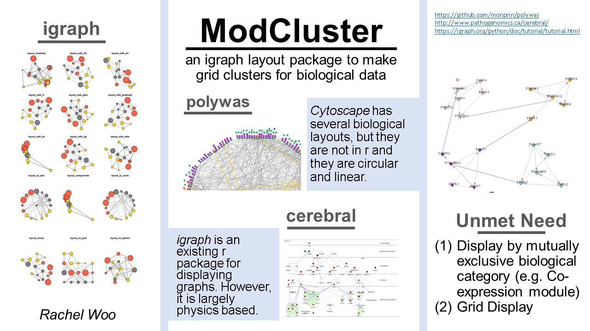
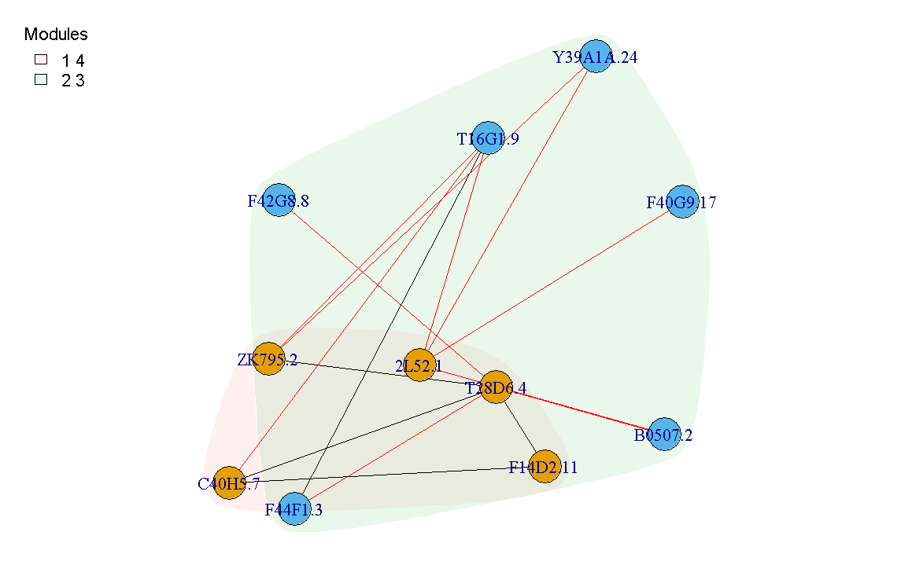
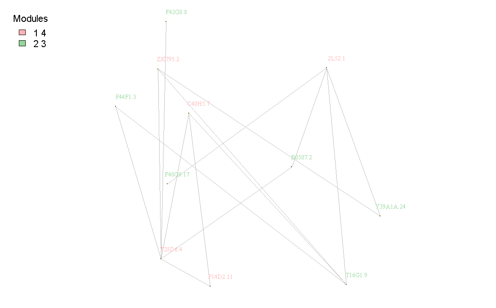

```{r, include = FALSE}
knitr::opts_chunk$set(
  collapse = TRUE,
  comment = "#>",
  fig.path = "man/figures/README-",
  out.width = "100%"
)
```

# modCluster

<!-- badges: start -->
<!-- badges: end -->

## 1. Description

The goal of modCluster is to visualize relationships beetwen modules in graphs. 

For graphs with biological significance it is common for there to be "modules" associated with verticies. Some examples include sub-cellular location, co-expression module or GO-term. Modcluster stands for "cluster by module", and groups modules together if they have an increased edge density together. With this package biologists will be able to get an idea which modules share highly significant communication through edges. 

## 2. Installation

To download the package

```{r}
require("devtools")
devtools::install_github("raywoo32/modCluster", vignettes = TRUE)
library("modCluster")
```

To run the shinyApp:

```{r shiny}
modCluster::modClusterShiny()
```


## 3. Overview 

#### Vignettes

To view vignette please use the following command 

```r
browseVignettes("modCluster")
``` 

#### Main components 

modCluster will:

1. Verify data is in the correct format
2. Group modules if they have an increased edge density between module than in the more connected module itself. 
3. Layout graph based on new modules
4. Visualize graph
  * Please see the vignette for more detail on input data format and for more detail on visualizing options. 

#### Pitch

This initial pitch image will also provide more context for the package. 



## 4.  Contributions

lsf.str("package:modCluster")

While there are many different ways to cluster modules extant in biological literature they do not have the same function as modCluster. While igraph already has a function to cluster_edge_betweenness(), it does not take into account some users may want to treat verticies as a unit. ModCluster allows the user to maintain module unity which represent important biological connections. While modCluster by no means replaces functions like cluster_edge_betweenness(), it allows the user to explore which modules have the most communication between them. 

Below the functions in modCluster are listed and contributions from other packages are acknowledged. In all functions an igraph object is used to represent the graph, this is not indicated below since it would be redundant but other uses of igraph indicated.  

clusterByModule() : This is a controller function. It calls other functions (from modCluster) to verify the format, group by module and visualize. It is hard to say how original it is by itself because it functions as a controller for the user. 

checkValidInput() : This is the function that verifies the format, catches errors (original code) and makes the edges and verticies into an igraph object. Obviously igraph is used for this. 

makeModuleGraphs() : Make module graphs uses an igraph function to create subgraphs for each module grouping. These subgraphs are placed into a dataframe along with the edge density. This is original although it uses an igraph  function to make subgraphs because the subgraphs are not automated for modules. This code just allows for easy calculations downstream in future code. 

edge_density() : Is called by makeModuleGraphs. Although adapted from igraph, this code is original because it implements a feature to calculate edge density based upon weight and not just presence absence as in igraph. 

getAllPossibleGroups(): This is a unique function create all possible group combinations to later check if the grouping has a higher intra-edge density than the group alone. It also calculates the combined edge density of every group. 

makeSortedCompare() : This function that combines the possible grouped modules with the original modules and sorts them in order of highest edge density. It is unique 

chooseBestGroups() : This is a unique function that takes the sorted modules and chooses groupings.

getChosenMods() : Gets a df with module name, subgraph and density for the chosen optimal groupings. This function is unique and supported by the previous helper functions. 

makeLayout() : makeLayout is unique in that it takes a unique data format from the previous workflow. However, it uses work previously done by igraph to choose the optimal layout for the modules and combine them. It is not totally unique as it is part of the visualization step. 

makeCommunities() : make communities is reliant on igraph (it is a visualization step) it takes the previous optimally calculated groupings puts it into an igraph format for quick visualization and to use exisiting functionality. 

visualizeCommunities() : uses the igraph communities function to create the plot. Again, it is somewhat unique in that it adapts my clustering in a manner that can use igraph visualizations. 

visualizeGraphs() : similar to visualize communities this function also adapts my clustering in a manner that can use igraph visualization. The user can choose between the two functions by the flag in clusterByModule. 

More information about the functions can also be found in the vignettes. 

## 5. References:

Please note references are also imbedded in code. 

#### Conceptual Citations 

1. Csardi G, Nepusz T: The igraph software package for complex network research, InterJournal,
  Complex Systems 1695. 2006. http://igraph.org
2. Hadley Wickham's (rpackages)[http://r-pkgs.had.co.nz/]
3. Winston Chang, Joe Cheng, JJ Allaire, Yihui Xie and Jonathan McPherson (2019). shiny: Web
  Application Framework for R. R package version 1.4.0.
  https://CRAN.R-project.org/package=shiny
4. Daniel Wong's analysis of edge density calculation based on weighted edges https://www.quora.com/How-do-you-compute-the-density-of-a-weighted-graph
5. Tokuyama, Takeshi, ed. Algorithms and Computation: 18th International Symposium, ISAAC 2007, Sendai, Japan, December 17-19, 2007, Proceedings. Vol. 4835. Springer, 2008.
6. Boris steipe's (rpt)[https://github.com/hyginn/rpt]
7. Prof. Anjali Silva's modules provided for BCB410
8. Xie Y (2019). knitr: A General-Purpose Package for Dynamic Report Generation in R. R package version 1.26, https://yihui.name/knitr/.
9. Scrucca L., Fop M., Murphy T. B. and Raftery A. E. (2016) mclust 5: clustering, classification and density estimation using Gaussian finite mixture models The R Journal 8/1, pp. 205-233 

#### Coding help citations 

1. https://stackoverflow.com/questions/18142117/how-to-replace-nan-value-with-zero-in-a-huge-data-frame/18143097
2. https://stackoverflow.com/questions/10085806/extracting-specific-columns-from-a-data-frame
3. https://stackoverflow.com/questions/18142117/how-to-replace-nan-value-with-zero-in-a-huge-data-frame/18143097
4. https://stackoverflow.com/questions/10085806/extracting-specific-columns-from-a-data-frame
5. https://stackoverflow.com/questions/8936099/returning-multiple-objects-in-an-r-function
6. https://stackoverflow.com/questions/24595716/assign-colors-to-communities-in-igraph
7. https://stackoverflow.com/questions/32507042/return-data-frame-values-with-list-of-indices
8. https://shiny.rstudio.com/articles/tabsets.html
9. https://stackoverflow.com/questions/12193779/how-to-write-trycatch-in-r
10. https://stackoverflow.com/questions/24595716/assign-colors-to-communities-in-igraph
11. https://stackoverflow.com/questions/24595716/assign-colors-to-communities-in-igraph
12. http://www.sthda.com/english/wiki/add-legends-

## 6. Example: 

A simple example of how to use modCluster

```{r example}
library(modCluster)
load("./data/exampleEdge.Rda")
load("./data/exampleVert.Rda")
clusterByModule(edges, vert, displayCommunity=FALSE)
clusterByModule(edges, vert, displayCommunity=TRUE)
```





