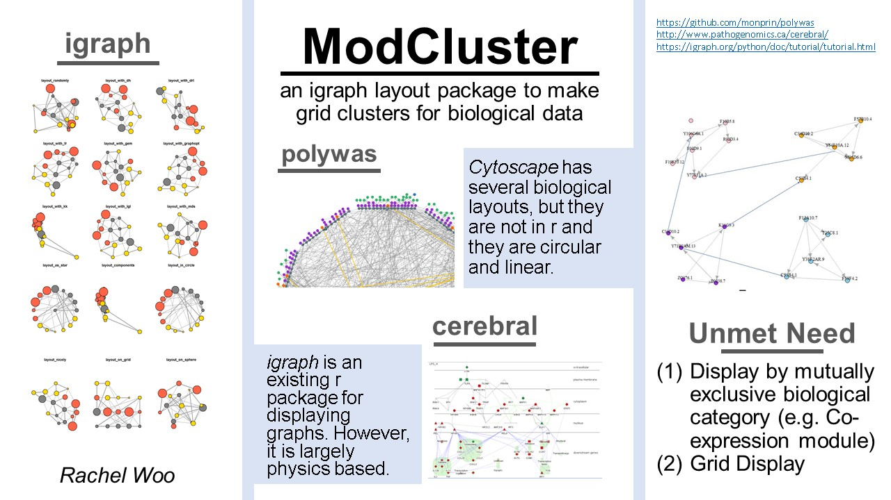

# modCluster

<!-- badges: start -->
<!-- badges: end -->

The goal of modCluster is to make a clustering algorithm to group the modules in an igraph object that have the highest density of edges. 

## Installation

To install the latest version of the package:

``` r
require("devtools")
install_github("raywoo32/modCluster")
library("modCluster")
```

## Overview

An overview of the package is illustrated below. 


This package visualizes an igraph object by clustering vertex associated modules. The modules are clustered by edge density, that is, if the edge density would improve by combining modules the modules will be combined. The modules can be visualized with gene names or without. This package can be used to see the link between gene interactions and a mutually exclusive biological category such as co-expression or gene location. 

The clustering algorithm is based on density, a metric of relative edge connectivity. When the edge connectivity within a module is less than the module combined with another module (assuming it is true both ways and there is no better match) modCluster authomatically clusters the modules together and visualizes them together. 

This will help link different types of biological information - interactions and another mutally exclusive biological category. 

## Contributions

The author of the package is Rachel Woo. The functions available within this 
package include:

``` r
library("modCluster")
```

- modCluster

The function modCluster is the only exported and controller function. modCluster takes 2 data frames that describe the edges and verticies as well as a flag to display or hide gene names. 

modCluster(edge, genes, displayGene)


