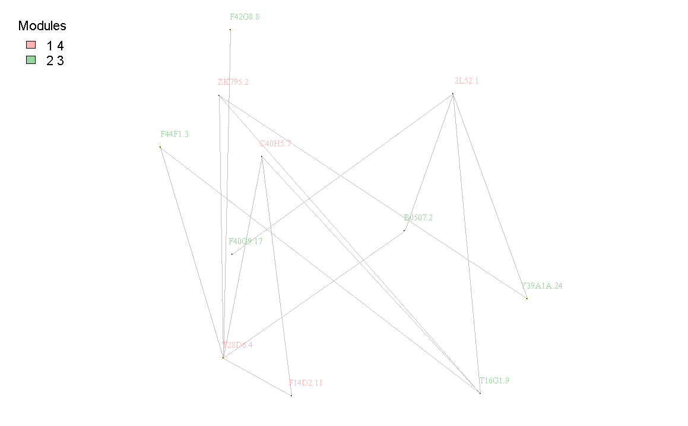

```{r}
require("devtools")
devtools::install_github("raywoo32/modCluster", dependencies=TRUE)
library("modCluster")
```

# Introduction 

For graphs with biological significance it is common for there to be "modules" associated with verticies. Some examples include sub-cellular location, co-expression module or GO-term. Modcluster stands for "cluster by module", and groups modules together if they have an increased edge density together. With this package biologists will be able to get an idea which modules share highly significant communication through edges. 

This project was created following instruction provided by BCB410 at the University of Toronto. Important packages to its creation include igraph, knittr, mclust (documentation examples), Hadley Wickham's Rpackages, shiny and Boris Steipe's rpt package. For full citations please see README.Rmd.

# Workflow Description 

Very simply here follows a description of how modCluster operates 

1. Verify data format 
  * see Data Input section
2. Group modules if they have an increased edge density between module than in the more connected module itself. 
3. Layout graph based on new modules
4. Visualize graph
  * Please see the DISPLAYCOMMUNITY Format section for more detail 

# Clustering example 

A simple example of how to use modCluster

```{r}
library(modCluster)
clusterByModule(edgesData, verticiesData, displayCommunity=FALSE)
clusterByModule(edgesData, verticiesData, displayCommunity=TRUE)
```

# Data Input

modCluster only exports 1 function: 

1. modCluster::clusterByModule(EDGES, VERTICIES, DISPLAYCOMMUNITY)

###  EDGES Format 

* EDGES is a dataframe of strings that symbolizes an edge in a graph 
* GENE1 and GENE2 edge must has a weight and have a module in VERTICIES
* Column names are enforced and values cannot be null

| GENE1 | GENE2 | WEIGHT | 
|-------|------ |--------|
|  G1   |  G2   |    1   |  

###  VERTICIES Format 

* VERTICIES is a data frame of strings that is the modules associated with the verticies in a graph
* GENE have a module and be in <EDGES> at least once 
* Column names are enforced and values cannot be null
* Only 40 or less modules are supported 

| GENE | MODULE | 
|------|--------|
|  G1  |  1     |   
|  G2  |  2     |   

### DISPLAYCOMMUNITY Format 

displayCommunity a boolean flag to choose to display community markers. 

* (TRUE)
  * Displays community grouping
  * Diplay edge types: red edges are between created module edges, black edges are within a created module
* (FALSE)
  * Display gene name only and signify grouping by the colour of the gene name
  




# References

For other references please see README.Rmd
Scrucca L., Fop M., Murphy T. B. and Raftery A. E. (2016) mclust 5: clustering, classification and density estimation using Gaussian finite mixture models The R Journal 8/1, pp. 205-233 


```{r}
sessionInfo()
```
